# Setting up Tinylytics

<!--- <details> --->
Table of Contents
* [Getting the Plugin](#getting-the-tinylytics-plugin)
* [Importing the Package](#import-the-package-into-your-project)
<!--- </details> --->

## Getting the Tinylytics Plugin
Go to releases and download the latest version, a .unitypackage file.
TODO

## Import the package into your project
In Unity, right click in the assets area and go to "Import Package > Import Custom Package" and import all the contents.
   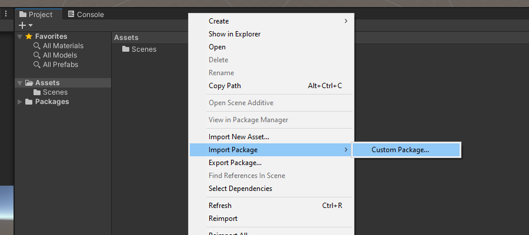


# Configuring your GoogleSheet database
These steps will show you how to set up a google sheet to act as your "database" to send event data to.

## Setting up the sheet

1. Click here: [Tinylytics Data Destination Template](https://docs.google.com/spreadsheets/d/1afYRzPYwN3HHg_G63SF9lM1i2gaFDpsbTZCkur6cVnk/copy "Tinylytics Data Destination Template"), then "Create Copy" to create your own copy of the template sheet

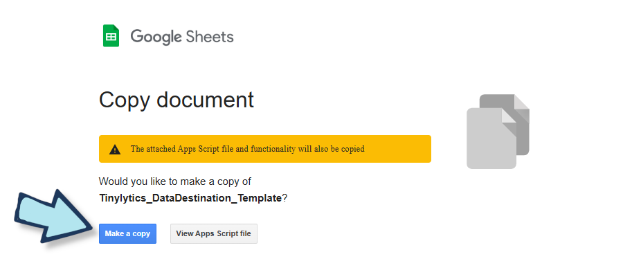

2. Name it whatever you’d like. You can rename it whenever you want later too, and you can move the document wherever you want as well.

3. In your new copy, go to Extensions > AppsScript
   
   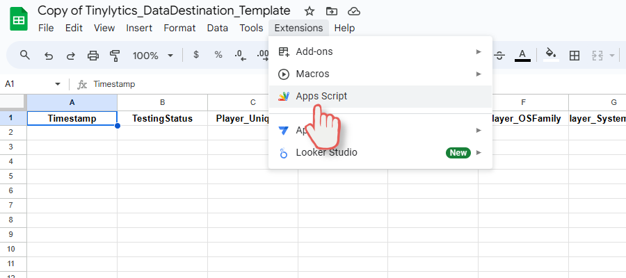

   This will open a new tab, a project named Tinylytics_Instance, with a single script called PostGetHandling.gs
4. In the Apps Script window, go to Deploy > New Deployment
   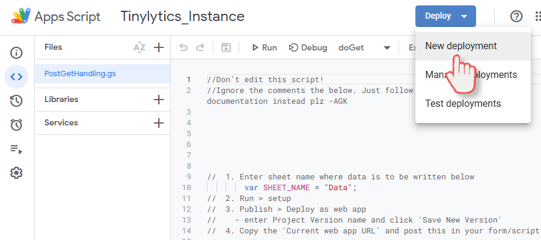

5. That will bring up a prompt like this. Enter a quick description for what you’re using this for ("Gathering data!"). Make sure “Who has Access” is set to “Anyone”.
   
   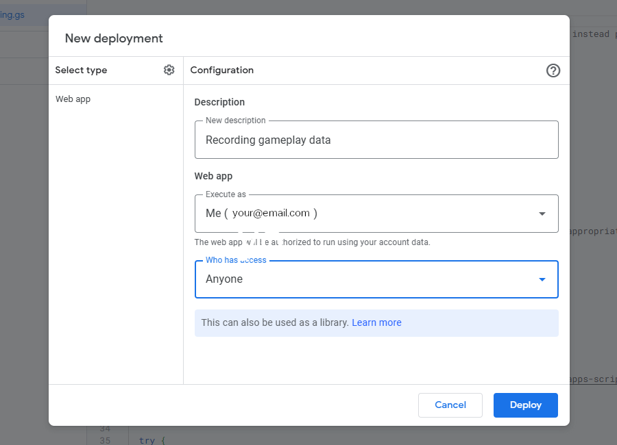
6. Then click “Deploy”
7. An Authorization Required prompt should appear. Click “Authorize Access”

   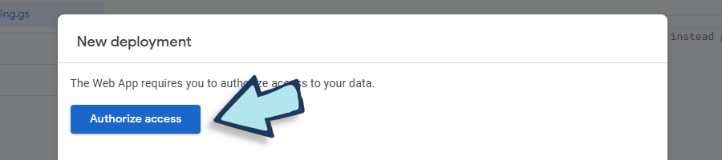

   Note: This is authorizing this workbook's scripts to edit this particular workbook. No one else has access to your data!
   
8. An authorization window will appear, click "Allow"
    
   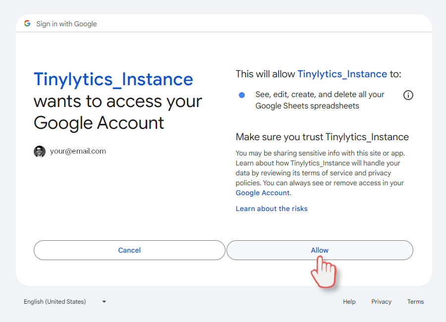
   
9. After a short delay, you'll get a deployment confirmation. Click “Done” to close the deployments window. Don't worry about the deployment_id, we'll come back and copy it in a moment.
10. Back in the Apps Script window, click the dropdown at the top of the code editor, and select the “Setup” function. Then click “Run”.
    
    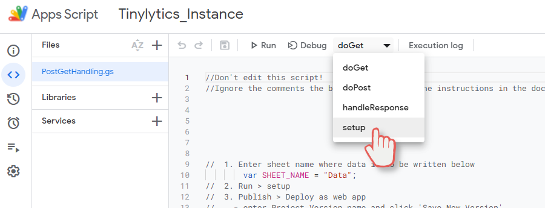
    
    Note: If the authorization prompt didn’t appear earlier, it should now.
    
11. After running the setup function, navigate again to “Deploy”, and “Manage Deployments”. We need the “Deployment ID”, it’s a long code of letters and numbers. Copy it.
    
    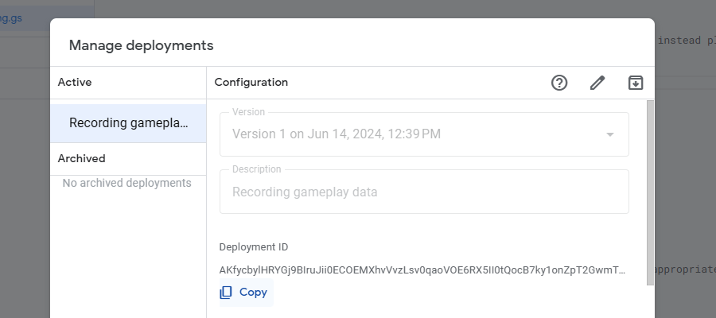
    
    Now we go back to Unity!

## Configuring Tinylytics in Unity

1. Back in Unity, click Windows > Tinylytics > Configure, to bring up the config window.
   
   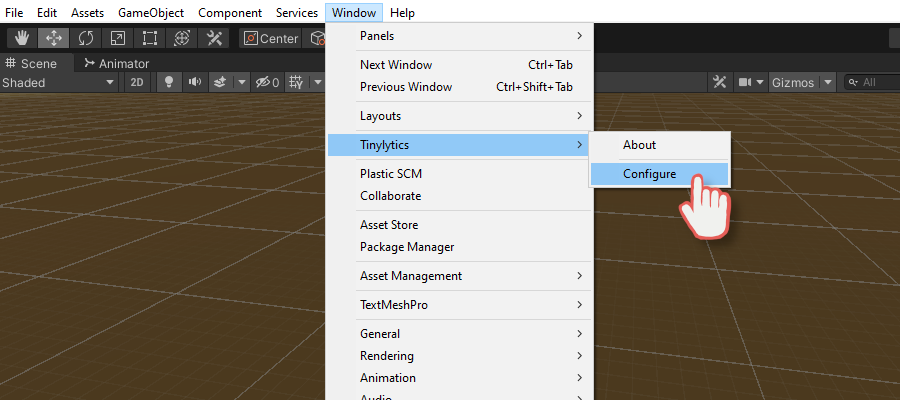
   
3. Paste the code from step 8 into the Deployment ID field. Close this window.
   
   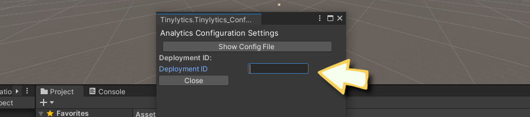
   
5. To check if it’s working, go to Assets / Tinylytics_AnalyticsTool / _DemoScene
6. Click on “ExampleScene” and hit play, wait a moment, and then exit play mode. Now go back to your data sheet. If you did everything correctly, you should see data populated!


```
Tinylytics.AnalyticsManager.LogCustomMetric("MetricName", "Data to send (as a string)" );
```
